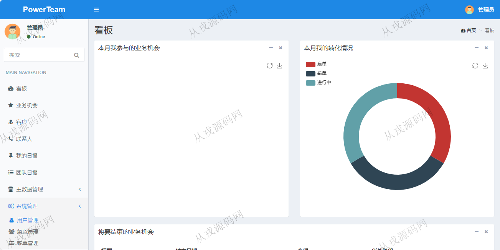

<h1 align="center">108.团队管理系统</h1>

 获取sql文件 QQ: 386869957 QQ群: 377586148 

 [推荐站点: 从戎源码网](https://armycodes.com/) 

## 简介

> 本代码来源于网络,仅供学习参考使用!
>
> 提供1.远程部署/2.修改代码/3.设计文档指导/4.框架代码讲解等服务
> 
> 访问地址：http://localhost:8080/
> 
> 管理员：admin 123456
> 
> 销售主管：manager1 123456
> 
> 普通销售：sales1 123456
>

## 项目介绍
基于springboot的团队管理系统：前端 freemarker、jquery，后端 maven、springmvc、spring、mybatis，角色分为管理员、销售主管、普通销售；集成看板、业务机会、我的日报、团队日报等功能于一体的系统。

## 功能介绍

- 看板：本月我参与的业务机会（图表），本月我的转化情况（图表），将要结束的业务机会（表格数据）
- 业务机会：初步接触中，需求分析中，协商方案中，商业谈判中、新机会，已完成
- 客户：客户信息的增删改查，按名称搜索客户
- 联系人：联系人信息的增删改查，按名称搜索联系人
- 我的日报：记录工作，工作日切换，切换日期，记录按时间线显示
- 团队日志：可以看到团队里成员的工作记录
- 组织架构：添加新组织，组织树形结构，分配用户
- 系统管理：用户信息的增删改查，角色信息的增删改查，分配用户，分配菜单，分配功能权限，菜单信息的增删改查

## 环境

- <b>IntelliJ IDEA 2021.3</b>

- <b>Mysql 5.7.26</b>

- <b>Tomcat 7.0.73</b>

- <b>JDK 1.8</b>

## 运行截图

